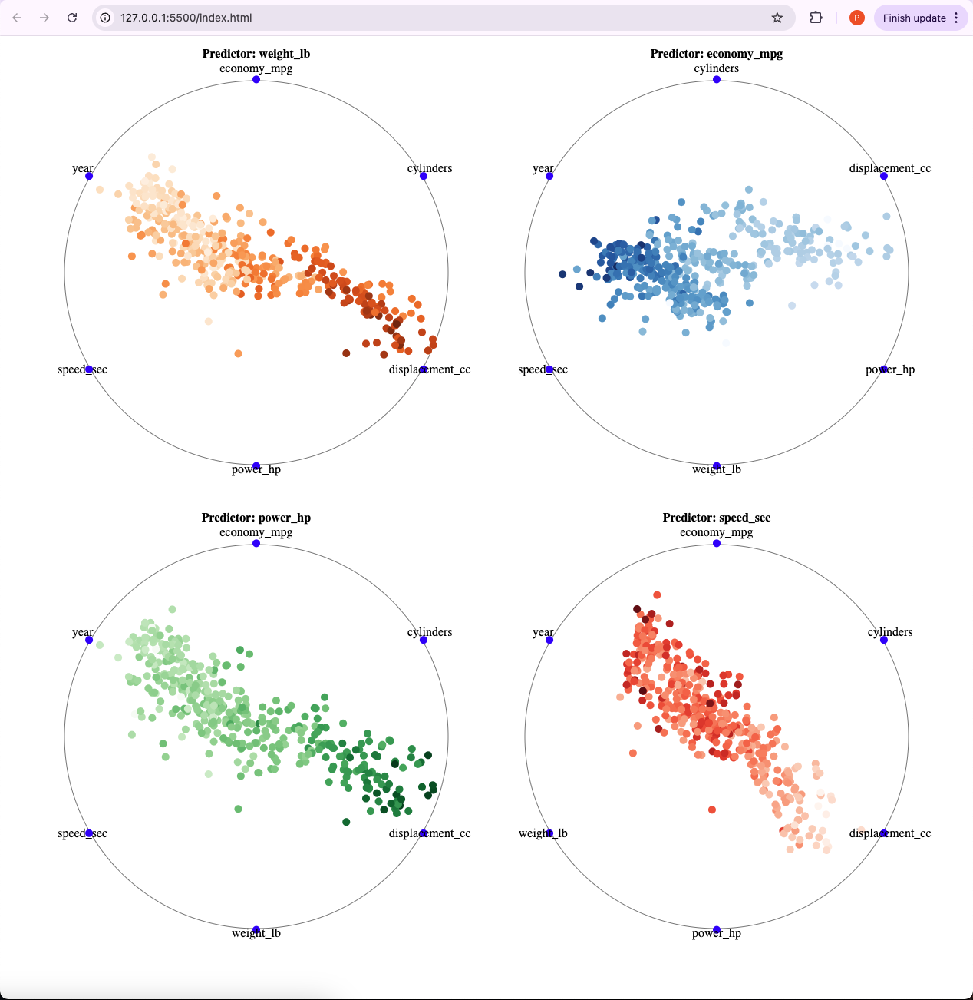

# Automobile Data Visualization using RadViz

## Overview
In this assignment, you will use **Radial Visualization (RadViz projection)** to explore and analyze attributes of the given automobile datasets. The task involves plotting multivariate data to observe patterns and clusters, particularly focusing on predicting dimensions like price, speed, or horse power. 

---

## Dataset
1. **cars.csv**:
   - Attributes: `economy_mpg`, `cylinders`, `displacement_cc`, `power_hp`, `weight_lb`, `speed_sec`.
2. **cars93.csv**:
   - Attributes: `type`, `price`, `mpg_city`, `passengers`, `weight`.

---

## Tasks

### 1. **RadViz Construction**
- **Read the Data**: Load the data into a convenient object for manipulation.
- **Choose Dimensions**: Select dimensions for the RadViz plot (e.g., use color for price prediction).
- **Normalize Data**: Scale all dimensions to a range of [0, 1] to avoid bias.
- **Unit Circle**: Assume a unit circle at the origin and uniformly distribute dimensions around it.
- **Vector Computation**: Compute vectors from the center `(0, 0)` to each dimension.
- **Position Points**: Scale dimension vectors and sum them to determine the final position of each point in the RadViz plot.
- **Map Points**: Visualize the computed points on the plot.

---

### 2. **Data Analysis and Prediction**
- Experiment with the **dimension order** around the circle to identify patterns or clusters.
- Use **color coding** for one of the dimensions (e.g., price or horse power).
- Identify and highlight the separation of clusters for analysis.
- Produce **at least 4 visualizations** with meaningful interpretations.

---

## Example Output
The output might include plots where:
- **Vehicle weight** is used as the predicting dimension.
- Data points are clustered based on **price**, **speed**, or **horse power**, providing insights into attribute correlations.

---

## References
- **Color Resources**:
  - [D3.js Scale Chromatic](https://d3js.org/d3-scale-chromatic/sequential)
  - [D3 Graph Gallery - Custom Colors](https://d3-graph-gallery.com/graph/custom_color.html)

---
